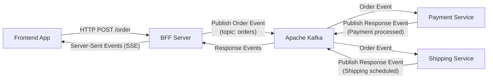

# Apache Kafka Example App (JavaScript, FE, BFF, Microservices)

This repository demonstrates how Apache Kafka can be used to connect a simple Frontend App with a Backend-for-Frontend (BFF) and two microservices. 

In this example, a user submits an order through a web interface, and the BFF publishes an order event to Kafka. Two microservices (Payment Service and Shipping Service) consume the event, process it asynchronously, and publish response events back to Kafka. The BFF then pushes these updates to the frontend via Server-Sent Events (SSE).

## Table of Contents

- [Architecture Overview](#architecture-overview)
- [Project Structure](#project-structure)
- [Setup and Installation](#setup-and-installation)
- [Running the Demo](#running-the-demo)
- [Usage](#usage)
- [Mermaid Diagram](#mermaid-diagram)
- [Notes](#notes)

## Architecture Overview

1. **Frontend App**  
   A simple HTML/JavaScript page that allows users to submit an order and listens for order status updates.

2. **BFF (Backend for Frontend)**  
   A Node.js Express server that:
   - Exposes a `POST /order` endpoint to receive order requests.
   - Publishes order events to Kafka on the `orders` topic.
   - Listens for response events on the `order-responses` topic and pushes updates to the frontend via SSE.

3. **Microservices**  
   Two separate Node.js services:
   - **Payment Service:** Processes the order for payment and publishes a "Payment processed" event.
   - **Shipping Service:** Processes the order for shipping and publishes a "Shipping scheduled" event.

4. **Apache Kafka**  
   Serves as the messaging backbone to decouple the BFF and microservices using asynchronous event communication.

## Project Structure

```
kafka-demo/
├── bff/
│   └── server.js
├── frontend/
│   └── index.html
├── microservices/
│   ├── payment-service.js
│   └── shipping-service.js
├── docker-compose.yml
└── package.json
```

- **bff/server.js:** Express server handling API requests and SSE.
- **frontend/index.html:** The simple web interface.
- **microservices/payment-service.js & shipping-service.js:** Microservices consuming order events and producing response events.
- **docker-compose.yml:** Configuration for running Kafka (and Zookeeper) using Docker.
- **package.json:** Node.js dependencies (e.g., `express` and `kafkajs`).

## Setup and Installation

### Prerequisites

- [Node.js](https://nodejs.org) (v14+ recommended)
- [Docker](https://www.docker.com) (to run Kafka via Docker Compose)

### Step 1: Clone the Repository

```bash
git clone https://github.com/your-username/kafka-demo.git
cd kafka-demo
```

### Step 2: Install Dependencies

Install dependencies for Node.js components. If you have a shared `package.json` at the root, run:

```bash
npm install
```

> **Note:** If you prefer to install dependencies separately for each component (BFF and microservices), navigate to each directory and run `npm install`.

### Step 3: Start Kafka with Docker Compose

Ensure Docker is running, then start Kafka and Zookeeper:

```bash
docker-compose up -d
```

The `docker-compose.yml` file is configured to expose Kafka on `localhost:9092`.

## Running the Demo

1) **Start the BFF Server:**

    In a terminal, run:

    ```bash
    node bff/server.js
    ``` 

    The BFF server will start on [http://localhost:3000](http://localhost:3000) and serve the frontend.

2) **Start the Microservices:**

    Open separate terminal windows for each microservice and run:

    ```bash
    node microservices/payment-service.js
    ```

    and

    ```bash
    node microservices/shipping-service.js
    ```

3) **Access the Frontend:**

   Open your browser and navigate to [http://localhost:3000](http://localhost:3000). Click the **Create Order** button to submit a new order. The frontend will display order status updates as they are processed by the microservices.

## Usage

- **Submitting an Order:**  
  Click the **Create Order** button on the web page to trigger a `POST /order` request to the BFF.

- **Status Updates:**  
  The BFF subscribes to Kafka events from the `order-responses` topic and uses Server-Sent Events (SSE) to push these updates to the frontend.

## Mermaid Diagram

Below is a Mermaid diagram illustrating the architecture:



You can visualize this diagram using [Mermaid Live Editor](https://mermaid.live).

## Notes

- **Simplifications:**  
  This demo uses simulated delays for payment and shipping processing. In production systems, these components would perform actual business logic.

- **Enhancements:**  
  Consider adding error handling, logging, security measures, and using WebSockets for real-time communication in production environments.

- **Scaling:**  
  Kafka consumer groups allow for horizontal scaling of microservices if needed.

## License

This project is licensed under the [MIT License](LICENSE).
